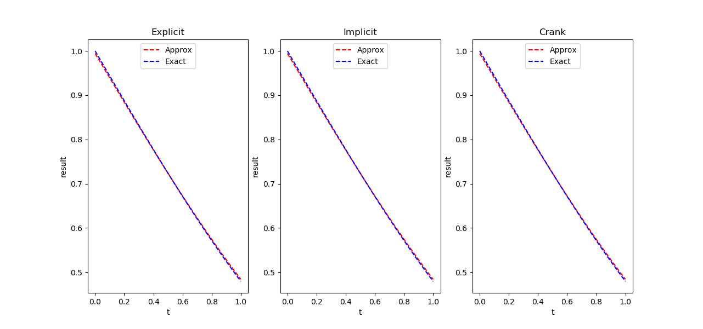

# 1D_DiffusionProcess
Estimating a 1D heat equation diffusion process via Explicit, Implicit, and Crank-Nicolson methods.  These 
solutions have been implemented in NumPpy using Linear Algebra.  The results themselves are hard to tell apart. 
The Heat Equation itself can be modelled in 1D, 2D, or 3D to show the diffusion of heat across a number of different 
constructs.  Here, it is only estimated in 1D for general use and to show the Linear Algebra solution.

